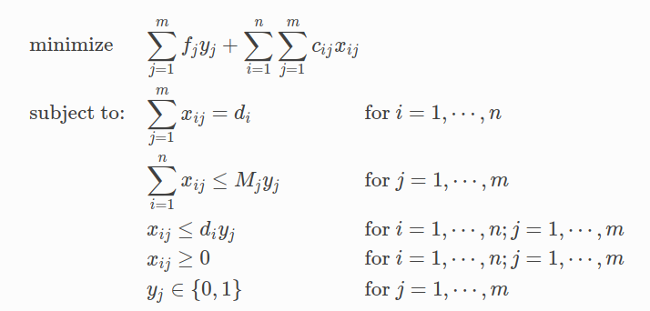
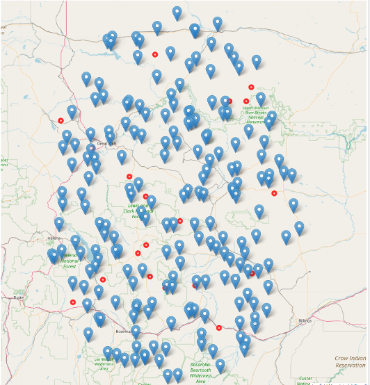
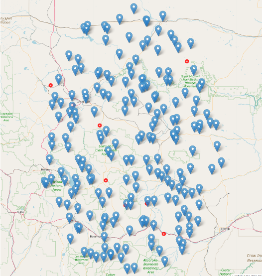

# Business location analysis example
The success or failure of a business in making the money heavily depends on location. Site selection answers the "why here" question that is the physical location where your address will take place. This repo sets up a programming environment for optimization problems and solves a simple variation of the above business problem: optimal facility location.

Facility location is a classical optimization problem for determining the sites for factories and warehouses. A typical *facility location problem* consists of choosing the best among potential sites, subject to constraints requiring that demands at several points must be serviced by the established facilities. The objective of the prboblem is to select facility sites in order to minimze costs; these typically include a part which is proporional to the sum of the distances from teh demand sites to the servicing facilities, in addition to costs of opening them at the chosen sites. The facilities may or may not have limited capacities for servicing, which classifies the problems into capacitated and uncapacitated variants.

In modeling distribution systems, decisions must be made about tradeoffs between transportation costs and costs for operating distribution centers. As an example, suppose that a manager must decide which of *m* warehouses to use for meeting the demands of *n* customers for a good. The decisions to be made are which warehouses to operate and how much to ship from any warehouse to any customer.

# Capacitated facility location problem
The *capacitated facility location problem* is the basis for many practical optimization problems, where the total demand that each facility may satisfy is limited. Hence, modeling such problems must take into account both demand satisfaction and capacity constraints.

Let us start with a concrete example. Consider a company with 20 potential sites for installing its facilities/warehouses and 200 demand points. Each site *j* has a yearly *activation cost* f<sub>j</sub> i.e., an annual leasing expense that is incurred for using it, independently of the volume it services. This volume is limited to a given maximum amount that may be handled yearly, M<sub>j</sub>. Additionally, there is a transportation cost c<sub>ij</sub> per unit serviced from facility *j* to the demand point *i*.

The problem can be formulated as below:


The objective of the problem is to minimize the sum of facility activation costs and transportation costs. The first constraints require that each customer's demand must be satisfied. The capacity of each facility $j$ is limited by the second constraints: if facility $j$ is activated, its capacity restriction is observed; if it is not activated, the demand satisfied by $j$ is zero. Third constraints provide variable upper bounds; even though they are redundant, they yield a much tighter linear programming relaxation than the equivalent, weaker formulation without them. Notice that the formulation is correct even if we omit constraints $x_{ij} \le d_j y_j$, for $i=1,...,n; j=1,...,m$. Removing that constraint, the problem may suddenly become very difficult to solve, especially as its size increases; the reason is the *big M pitfall*. Large values for *M* do disturb the model in practice. A large number *M* must be set to a value as *small* as possible.

## Example
We consider a case when there are 200 customers and 20 warehouses from which we would like to pick the best location that would meet the customer's demand. Each warehouse is associated with an activation cost and a transportation cost to reach each customer. You can generate a random problem using the script ```GenerateProblem.py```. The problem configuration sits in ```Scenarion.xlsx```. The blue markers denote the customers and the red marker circles denote the (potential) warehouse locations.



The optimal solution to this facility location problem by solving a mixed-integer programming problem (run```Problem.py``` to solve the problem.) is shown below:


